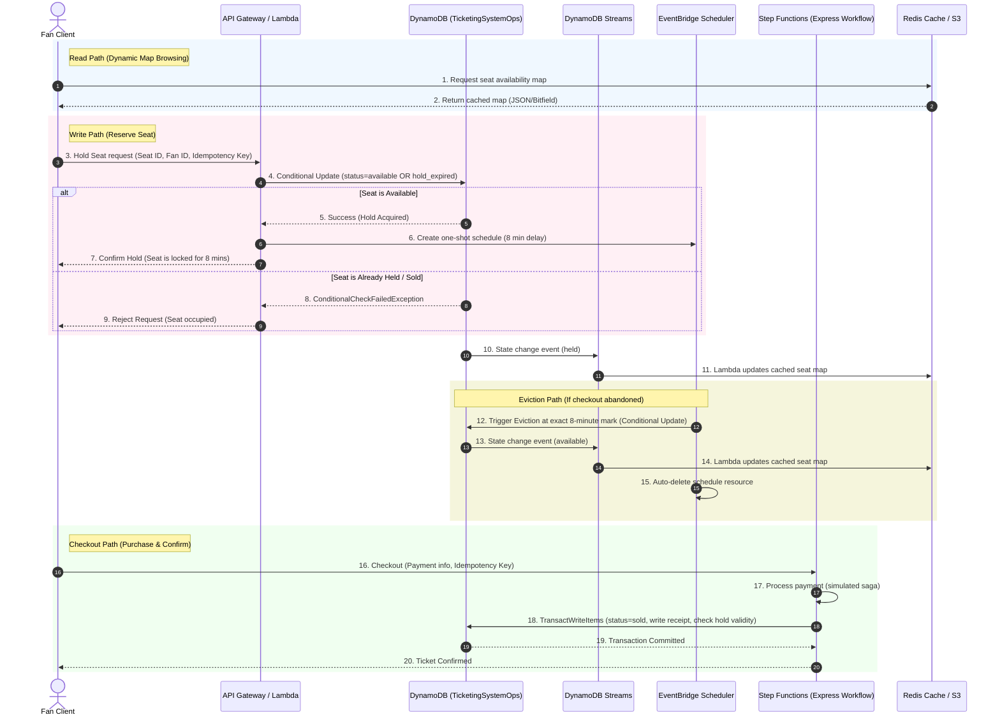

# **Project Implementation Roadmap: The Fair Seat Purchase**

This document details the phase-by-phase development plan for building the high-concurrency ticketing system outlined in [DynamoDB Seat Purchase Architecture.md](file:///C:/Users/amitk/Documents/Hackathons/the%20fair%20seat%20purchase/DynamoDB%20Seat%20Purchase%20Architecture.md).

---

## **System Architecture Diagram**



---

## **Proposed Repository Structure**

We will organize the project repository as follows:

```text
the-fair-seat-purchase/
├── .github/
│   └── workflows/              # CI/CD pipelines
├── state-machines/
│   └── checkout-saga.asl.json  # AWS Step Functions ASL Definition
├── src/
│   ├── handlers/
│   │   ├── hold-seat.js        # Lambda to handle seat hold reservations
│   │   ├── stream-consumer.js  # DynamoDB Stream aggregator (syncs S3/Redis cache)
│   │   ├── process-payment.js  # Payment gateway simulator (used in Step Function)
│   │   └── confirm-purchase.js # TransactWriteItems seat confirm Lambda
│   ├── utils/
│   │   ├── dynamodb.js         # DynamoDB client helper & expressions
│   │   ├── scheduler.js        # EventBridge Scheduler wrapper
│   │   └── idempotency.js      # Idempotency token storage helper
│   └── package.json            # Node.js dependencies (aws-sdk v3, etc.)
├── tests/
│   ├── unit/                   # Unit tests (Mock DDB client)
│   │   ├── hold-seat.test.js
│   │   └── idempotency.test.js
│   ├── load/
│   │   ├── load-config.yml     # Artillery performance test configuration
│   │   └── load-test.js        # Artillery custom payload functions
│   └── integration/            # Step-by-step API integration tests
├── tools/
│   └── seed-stadium.js         # Command line utility to pre-populate 100k seats
├── template.yaml               # AWS SAM (Serverless Application Model) Template
├── DynamoDB Seat Purchase Architecture.md
└── ROADMAP.md
```

---

## **Phase-by-Phase Implementation Plan**

### **Phase 1: Foundational Data Modeling & Seed Utility**
* **Goal:** Configure the single-table DynamoDB layout, model the entities, and build a seed script that can initialize 100,000 seat records across various stadium sections.
* **Tasks:**
  1. Draft the JSON schema model for AWS NoSQL Workbench.
  2. Implement `tools/seed-stadium.js` to batch-write 100,000 seats.
     * Seat Format: `PK: VENUE#Wembley`, `SK: SEAT#Sec<1-20>#Row<A-Z>#Seat<1-50>`.
     * Attributes: `status = "available"`, `held_by = null`, `hold_expires_at = 0`.
* **Deliverables:**
  * Workbench JSON export containing sample data model (committed to repo at `tools/nosql-workbench-export.json`).
  * Executable Node.js seed script.

---

### **Phase 2: Local Setup & Serverless Architecture Definition (IaC)**
* **Goal:** Define the AWS infrastructure as code using AWS SAM (`template.yaml`), enabling local development and testing of Lambdas.
* **Tasks:**
   1. Define the DynamoDB table `TicketingSystemOps` in SAM template with:
      * Primary Key schema: Partition Key `PK` (String), Sort Key `SK` (String).
      * DynamoDB Stream enabled (`StreamViewType: NEW_AND_OLD_IMAGES`).
      * Billing Mode: `PAY_PER_REQUEST` (On-demand scaling).
   2. Define API Gateway (HTTP API) with endpoints:
      * `POST /hold` — triggers `HoldSeat` Lambda.
      * `POST /checkout` — triggers `CheckoutSaga` Step Function (via `StartExecution`).
      * Enable throttling (burst limit: 5000, rate limit: 10000 per route) to protect backend.
   3. Define Lambda functions:
      * `HoldSeat` — handles seat reservation logic.
      * `StreamConsumer` — processes DynamoDB Stream events.
      * `ConfirmPurchase` — finalizes purchase inside Step Function.
      * Attach each Lambda to a Lambda Insights enabled group for observability.
   4. Define the Step Functions Express Workflow resource (`AWS::Serverless::StateMachine`):
      * Source from `state-machines/checkout-saga.asl.json`.
      * IAM role with DynamoDB `TransactWriteItems` and EventBridge `DeleteSchedule` permissions.
   5. Define IAM roles and policies:
      * `HoldSeat` role: DynamoDB `UpdateItem`, EventBridge `CreateSchedule`.
      * `StreamConsumer` role: DynamoDB Stream read, S3 `PutObject`, SQS `SendMessage` (DLQ).
      * `CheckoutSaga` role: DynamoDB `TransactWriteItems` + `ConditionCheck`, EventBridge `DeleteSchedule`.
   6. Set up the local development environment using LocalStack or AWS SAM local CLI testing.
      * Provide `docker-compose.yml` with LocalStack image for offline testing (Note: Advanced services like EventBridge Scheduler and Express Workflows may require LocalStack Pro; verify or use an AWS Sandbox account).
* **Deliverables:**
  * Validated `template.yaml` defining DynamoDB table, streams, API Gateway, Step Functions, and Lambda roles.
  * `docker-compose.yml` for LocalStack development (with sandbox fallback instructions).
  * Project `package.json` with AWS SDK v3 modules.

---

### **Phase 3: Core Transactional APIs (Holds & Idempotency)**
* **Goal:** Implement the seat reservation logic, protecting it from double-sales via DynamoDB conditional writes, and implement exactly-once processing using an idempotency guard.
* **Tasks:**
  1. **Idempotency Guard (`src/utils/idempotency.js`):**
     * Execute `PutItem` on table `TicketingSystemOps` for PK/SK `IDEMP#<uuid>` with condition expression `attribute_not_exists(PK)`.
     * If `ConditionalCheckFailedException` is thrown, fetch existing token and return it.
  2. **Seat Reservation (`src/handlers/hold-seat.js`):**
     * Use DynamoDB `UpdateItem` with an atomic conditional expression:
       ```javascript
       const params = {
         TableName: 'TicketingSystemOps',
         Key: { PK: 'VENUE#Wembley', SK: `SEAT#${seatId}` },
          UpdateExpression: 'SET #status = :held, held_by = :fanId, hold_expires_at = :expiresAt',
           ConditionExpression: '#status = :available OR (#status = :held AND :now > hold_expires_at)',
          ExpressionAttributeNames: { '#status': 'status' },
         ExpressionAttributeValues: {
           ':held': 'held',
           ':fanId': fanId,
           ':expiresAt': Math.floor(Date.now() / 1000) + 480, // +8 minutes
           ':available': 'available',
           ':now': Math.floor(Date.now() / 1000)
         }
       };
       ```
* **Deliverables:**
  * Fully tested Lambda implementation for seat holds.
  * Unit tests validating transaction locks under simulated concurrent requests.

---

### **Phase 4: Serverless Event-Driven Eviction (EventBridge Scheduler)**
* **Goal:** Implement deterministic lock evictions at the exact 8-minute expiration mark without utilizing background cron sweeper scripts.
* **Tasks:**
  1. Write EventBridge Scheduler helper (`src/utils/scheduler.js`).
  2. Upon successful seat hold, programmatically invoke the EventBridge `CreateSchedule` API:
     * **ScheduleExpression:** `at(YYYY-MM-DDTHH:MM:SS)` (exact millisecond in UTC + 8 minutes).
     * **Target:** DynamoDB `UpdateItem` Universal Target API.
     * **Target Input parameters:**
       ```json
       {
         "TableName": "TicketingSystemOps",
         "Key": { "PK": "VENUE#Wembley", "SK": "SEAT#Sec1#RowA#Seat12" },
         "UpdateExpression": "SET #status = :available REMOVE held_by, hold_expires_at",
         "ConditionExpression": "#status = :held AND held_by = :originalFanId",
         "ExpressionAttributeNames": { "#status": "status" },
         "ExpressionAttributeValues": {
           ":available": "available",
           ":held": "held",
           ":originalFanId": "FAN#12345"
         }
       }
       ```
     * **ActionAfterCompletion:** Set to `DELETE` to automatically clean up the EventBridge Schedule resource.
     * **Note:** Request an EventBridge Scheduler API quota increase (CreateSchedule/DeleteSchedule TPS) from AWS before high-concurrency launches to avoid throttling.
* **Deliverables:**
  * Eviction scheduler logic inside hold-seat workflow.
  * IAM Policy definitions in `template.yaml` authorizing Lambda to schedule tasks targeting DynamoDB directly.

---

### **Phase 5: Financial Sagas and checkout completion**
* **Goal:** Coordinate payment processing and seat state conversion from `held` to `sold` using AWS Step Functions Express Workflows.
* **Tasks:**
   1. Build the ASL file `state-machines/checkout-saga.asl.json` containing states:
      * `ValidateIdempotency` -> `ChargeCreditCard` (simulated third-party payment API) -> `CancelEvictionSchedule` -> `ConfirmPurchase` (DDB transaction) -> `Success`.
      * Error branch: If payment fails or database commit fails, trigger a refund/compensation step.
   2. The `CancelEvictionSchedule` step calls EventBridge `DeleteSchedule` to remove the 8-minute eviction schedule, preventing it from reverting the seat after successful purchase. (Note: The DynamoDB TransactWriteItems condition check acts as a fail-safe if DeleteSchedule fails or throttles).
   3. The `ConfirmPurchase` step runs a DynamoDB `TransactWriteItems` operation:
      * Check: The seat state must still be `held` by the buyer and `hold_expires_at > :now`.
      * Update: Transition seat state to `sold`.
      * Write: Insert the `TX#<TxID>` receipt record.
   4. Configure a Dead Letter Queue (SQS) for `StreamConsumer` Lambda to capture any stream processing failures without data loss.
   5. Configure Step Functions Express Workflow Logging level to `ALL` with a CloudWatch destination to ensure complete execution visibility.
* **Deliverables:**
  * Step Function ASL definition with `CancelEvictionSchedule` state.
  * Lambda functions for payment processing and atomic transaction updates.
  * SQS DLQ resource definition in SAM template.

---

### **Phase 6: CQRS Real-Time Materialized View (Streams to Cache)**
* **Goal:** Sync the active seat availability map globally without routing read queries to DynamoDB.
* **Tasks:**
   1. Implement `src/handlers/stream_consumer.js` to process DynamoDB Stream events.
   2. Maintain a two-tier cache:
      * **Hot cache (Redis/Memory):** Publish seat state changes to an ElastiCache Redis cluster for sub-millisecond reads by the live seat map API.
      * **Global edge cache (S3 + CloudFront):** Periodically aggregate the full seat map into compressed JSON/bitfield payloads and upload to S3, distributed globally via CloudFront for fan-facing browsing.
   3. Implement sharded counters mapping for section metrics to spread write contention (deterministic sharding by section ID).
* **Deliverables:**
  * Stream processing Lambda that writes to both Redis and S3.
  * Redis cluster definition (SAM template).
  * S3 bucket + CloudFront distribution configuration.
  * Sharded counter implementation for per-section availability.

---

### **Phase 7: Performance & Race Condition Load Testing**
* **Goal:** Validate the architecture under massive concurrent loads.
* **Tasks:**
   1. Set up an Artillery script in `tests/load/load-config.yml`.
   2. Simulate 50,000 requests hitting the hold seat endpoint targeting the same pool of highly desirable seats within a 30-second window.
   3. Simulate 10,000 concurrent checkout requests and verify the `CancelEvictionSchedule` step fires correctly.
   4. Simulate payment timeout / failure scenarios and confirm abandoned holds return to the pool in exactly 8 minutes.
   5. Verify that:
      * Exactly one user gets each seat (zero double-sells).
      * All failed requests are rejected instantly (no retry storms — verify `ConditionalCheckFailedException` count equals expected failures).
      * EventBridge schedules for purchased seats are deleted (stale schedule count = 0).
      * P99 latency for `POST /hold` stays under 500ms under peak load.
      * Stream consumer processes all events without falling behind (check CloudWatch `IteratorAge` metric).
* **Deliverables:**
  * Load testing scripts (Artillery config + custom payload functions).
  * CloudWatch dashboard screenshot / exported JSON demonstrating zero oversells and latency metrics.
  * Log analysis reports confirming no stale eviction schedules remain post-checkout.

---

### **Phase 8: Observability, CI/CD, and Documentation**

* **Goal:** Production-grade monitoring, automated deployments, and competition-ready documentation.
* **Tasks:**
  1. Set up CloudWatch dashboards with key metrics:
     * DynamoDB: `ConditionalCheckFailedRequests`, `ConsumedWriteCapacityUnits`, `ThrottledRequests`.
     * Lambda: `Invocations`, `Errors`, `Duration` p50/p99, `Throttles`.
     * Step Functions: `ExecutionsStarted`, `ExecutionsFailed`, `ExecutionTime`.
     * EventBridge: `ScheduleCount` (to detect stale schedules), `InvocationFailedCount`.
     * API Gateway: `4XXError`, `5XXError`, `Latency` p99, `ThrottleCount`.
  2. Set up CloudWatch alarms:
     * Alarm on `ThrottledRequests > 0` for DynamoDB (indicates hot-key issue).
     * Alarm on `IteratorAgeMilliseconds > 5000` for DynamoDB Stream consumer.
     * Alarm on `ScheduleCount > 10000` (approaching regional quota).
  3. Implement CI/CD pipeline (`.github/workflows/deploy.yml`):
     * On push to `main`: run unit tests, run SAM build, run SAM deploy.
     * On push to `feature/*`: run unit tests only.
     * Include `sam validate` step to catch template errors early.
  4. Finalize repository documentation:
     * Ensure `DynamoDB Seat Purchase Architecture.md` and `ROADMAP.md` are consistent.
     * Add architectural diagram (Mermaid or Draw.io) as described in the architecture doc.
     * Add a `SETUP.md` with local development instructions (LocalStack, env vars, etc.).
     * Verify NoSQL Workbench JSON export (`tools/nosql-workbench-export.json`) is committed and referenced in the README.
* **Deliverables:**
  * CloudWatch dashboard JSON export.
  * CI/CD workflow YAML (`.github/workflows/deploy.yml`).
  * `SETUP.md` with local development guide.
  * Final repository with all artifacts committed and cross-referenced.
